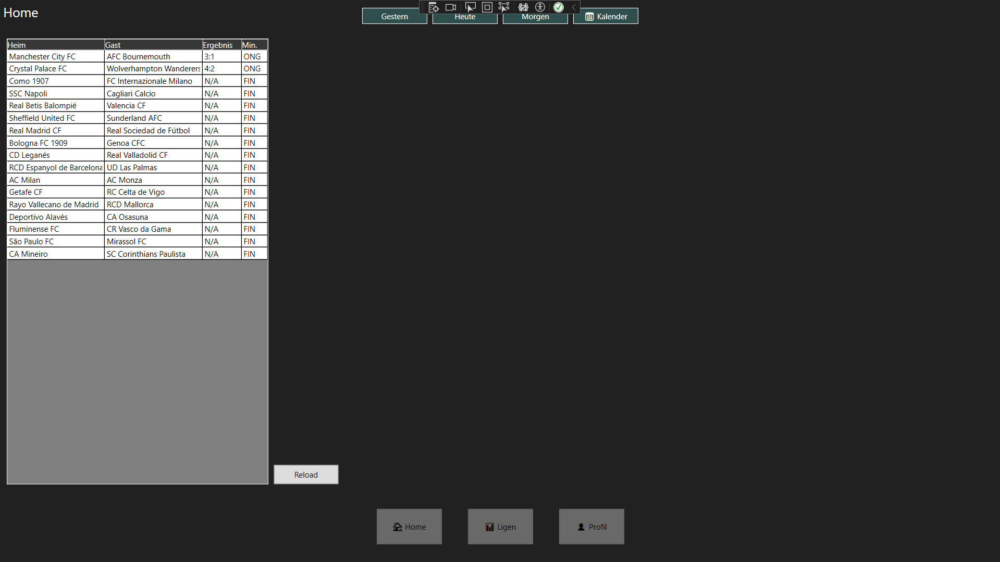
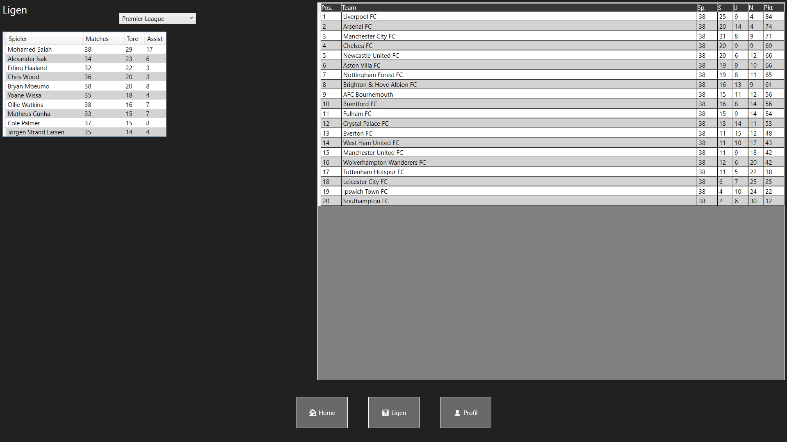

# Projekt: Zwo Football
**Klasse:** 2AHIF  
**Jahr:** 2024/2025  
**Projektgruppe:** Colin Küer, Jakob Seeberger  
**Betreuer:** Lukas Diem  

---

##  Kurzbeschreibung

Programm zur Einsehung von Spielergebnissen und Liga Tabellen seiner Wahl.


---

## Collage

Füge mindestens zwei Screenshots des Projekts ein.




---

##  Relevanter Programmcode

```csharp
 private void LoadProfiles()
 {
     if (!File.Exists(FileName)) return;

     try
     {
         string json = File.ReadAllText(FileName);
         var list = JsonSerializer.Deserialize<List<Profile>>(json);
         if (list != null)
             foreach (var p in list)
                 Profiles.Add(p);
     }
     catch (Exception ex)
     {
         MessageBox.Show($"Fehler beim Laden:");
     }
 }

 private void SaveProfiles()
 {
     try
     {
         var list = Profiles.ToList();
         string json = JsonSerializer.Serialize(list);
         File.WriteAllText(FileName, json);
     }
     catch (Exception ex)
     {
         MessageBox.Show($"Fehler beim Speichern:");
     }
 }
```


---

## 📅 Projektzeitplan

| Datum       | Aufgabe                                      | Bearbeiter   | Status (%) |
|-------------|----------------------------------------------|--------------|------------|
| 25.04.2025  | Projekt Idee sammeln                         | Beide        | 50%        |
| 29.04.2025  | Projekt Idee finalisieren -> Zwo Football    | Beide        | 100%       |
| 30.04.2025  | GUI Skizze machen                            | Jakob        | 100%       |
| 30.04.2025  | Klassen Skizze machen                        | Colin        | 70%        |
| 02.05.2025  | Heraussuchen & Testen einer geeigneten APi   | Jakob        | 60%        |
| 02.05.2025  | Klassen Skizze fertigstellen                 | Colin        | 100%       |
| 06.05.2025  | GUI programierung anfangen                   | Jakob        | 5%         |
| 07.05.2025  | GUI programierung weiter machen              | Jakob        | 50%        |
| 07.05.2025  | Klassen machen und rausfinden wie APIs fkt.  | Colin        | 30%        |
| 09.05.2025  | Klassen programierung helfen                 | Jakob        | 40%        |
| 10.05.2025  | Klassen programierung helfen                 | Jakob        | 100%       |
| 13.05.2025  | Klassen machen und rausfinden wie APIs fkt.  | Colin        | 100%       |
| 13-25.05.25 | GUI mit Klassen verbunden (cs code)          | Jakob        | 100%       |
| 13-25.05.25 | Funktionen gemacht und verbunden mit GUI     | Colin        | 60%        |
| 28.05.2025  | Tastenkombinationen eingebaut                | Jakob        | 100%       |
| 28.05.2025  | Funktionen gemacht und verbunden mit GUI     | Colin        | 70%        |
| 03-11.06.25 | Funktionen gemacht und verbunden mit GUI     | Colin        | 90%        |
| 03-11.06.25 | Getestet auf Bugs und gefixt                 | Colin        | 100%       |
| 03-11.06.25 | Alle DataGrid finalisiert und Verbunden      | Colin        | 100%       |
| 03.06.2025  | Serialize angefangen (ProfileWindow)         | Jakob        | 30%        |
| 04.06.2025  | Serialize weitermachen (hat mich genervt)    | Jakob        | 90%        |
| 06.06.2025  | Serialize fertig derserialize begonnen       | Jakob        | 30%        |
| 10-11.06    | Deserialize fertig gestellt                  | Jakob        | 100%       |
| 11-16.06    | Gui finalisiert und Bugs gefixt              | Jakob        | 100%       |


---

# Lastenheft

## 2.1 Kurzbeschreibung
Man kann seine Liblingsteams im Profil Fenster hinzufügen. Dessen Ergebnisse kann man dann im Home Fenster nach sehen. Ebenfalls kann man 12 Ligen im Ligen Fenster nach sehen. (leider nicht mehr aber sonst hätten wir für die andere API zahlen müssen)
## 2.2 Skizzen
Im Home Fenster werden in Einer Tabelle alle ERgebnisse der 12 Ligen dargestell und die gefilterten werden ebenfalls dargestellt. 
## 2.3 Funktionsumfang

### Must-Haves
- Ergebnisse ansehen 
- Lieblings Teams aussuchen dessen Ergebnisse werden serperat angezeigt
- aktueller Kader (leider nicht möglich wegen der API )
- Tabelle 
- Spieler Statistik (leider ebenfalls nicht möglich wegen der API aber ich hätte die Gui dafür gemacht)

### Nice-to-Haves
- Live Ergebnisse 
- Live Tabelle 
- Statistik Vergleich 
- Alles nicht möglich wegen der gratis API bekommen dazu keine Daten


---

# Pflichtenheft

## Interner Programmaufbau

- Wir ziehen Daten aus einer API und zeigen diese an
- In Reader stehen die Funktionen und API_Classes sind die Object in die wir einlesen

## Umsetzungsdetails
- Das auslesen aus der API wurde mit Bechtold zusammen gemacht beim ersten mal und danach haben wir immer nur die Funktion abgeändert damit sie das macht was wir machen
- Dass die API manchmal keine Daten rausgibt. Wir haben einen Restart Button eingebaut damit man sie manuell refreshen kann bis sie Daten gibt.

## Ergebnisse & Tests
- Programm läuft gut manchmal ladet es etwas länger um die Ergebnisse zu bekommen 
- eben die manchmal längere Ladezeit 

---

# Anleitung

## Installationsanleitung
Newtonsoft.Json

## Bedienungsanleitung
- mit Pfeiltasten kann man die Fenster wechseln und esc beendet man Vollbild 
- sonst man kann im Profil auf bearbeiten seine Lieblings Teams hinzufügen und sieht diese im Profil Fenster dann der Rest ist selbsterklärend 

---

#  Bekannte Bugs / Probleme
Wir können keine Ergebnisse anzeigen da wir von der API keine Ergebnisse bekommen. Ich versteh nicht wieso, da wir in Postman die Ergebnisse bekommen und das RootObject das wir benutzen auch die Ergebnisse fangt. Auf einem der Screenshots sieht man dass es funktioniert nur meistens bekommen wir keine Ergebnisse. Das war auch das erste mal dass es funktionierte.

---

# Erweiterungsmöglichkeiten
- Wenn wir 50€ pro Monat hätten und mehr Zeit würden wir definitiv unsere Nice to haves umsetzten wollen sonst haben wir alles umgesetzt was wir wollten.
---

